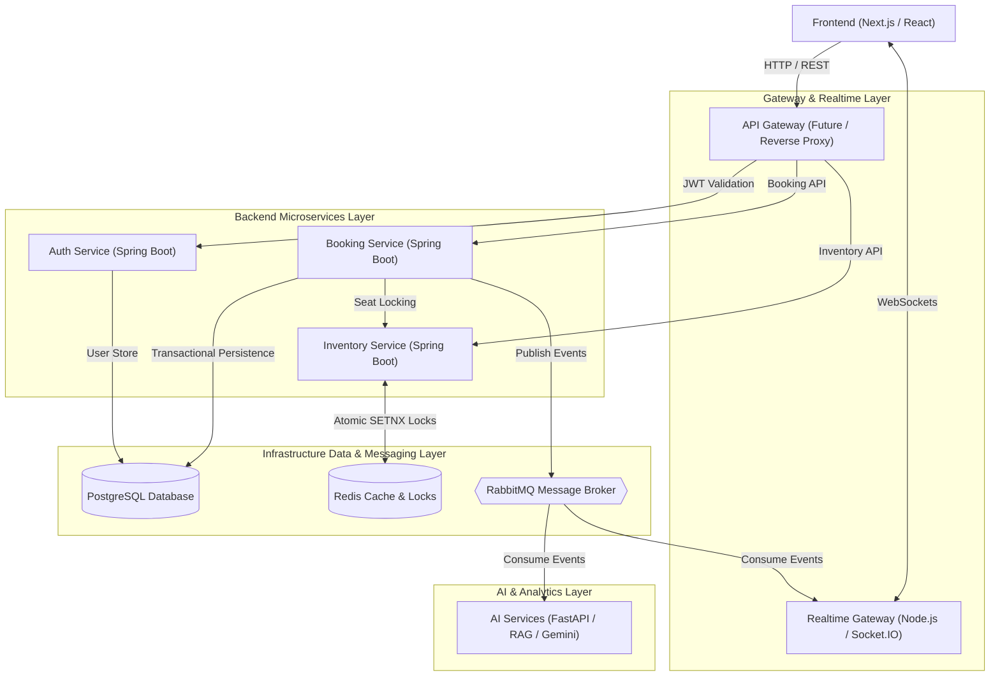

# SmartQueue AI — System Architecture Overview

**Document ID:** `ARCH-01`  
**Version:** `1.0.0`  
**Status:** `Active`  
**Owner:** SmartQueue AI Architectural Board  

---

## 1. Vision & Executive Summary

SmartQueue AI is an enterprise-grade, distributed reservation infrastructure platform designed to simulate and handle extreme high-concurrency booking environments (such as IRCTC Tatkal, Ticketmaster flash sales, redBus seat allocations, and BookMyShow venue reservations).

The platform serves as a blueprint for distributed systems engineering, demonstrating sub-second lock acquisition, zero double-booking under synthetic thundering-herd traffic, resilient event-driven microservices, real-time WebSocket state synchronization, and AI-powered queue intelligence.

---

## 2. Core Architectural Goals

1. **Deterministic Concurrency Control:** Guarantee 100% data integrity with zero double-bookings during extreme traffic spikes using Redis distributed locks (`SETNX` / Redlock) and PostgreSQL transactional isolation.
2. **Horizontal Microservice Scalability:** Decouple core domain bounded contexts into autonomous Spring Boot, Node.js, and Python microservices capable of scaling out statelessly.
3. **Asynchronous Decoupling & Flow Control:** Utilize RabbitMQ for event-driven workflows and queue backpressure management to shield downstream databases from thundering-herd overload.
4. **Sub-Second Real-Time Synchronization:** Push live queue updates, seat hold countdowns, and booking confirmations to client browsers using Socket.IO WebSockets.
5. **AI-Powered Queue Intelligence:** Provide semantic search, predictive queue wait times, and automated booking assistance using FastAPI, LangChain, and Gemini RAG workflows.
6. **Production-Grade Observability:** Maintain end-to-end request correlation (`X-Correlation-ID`) across HTTP REST, WebSockets, RabbitMQ AMQP, and database calls with structured JSON logging.

---

## 3. High-Level Architecture Diagram



---

## 4. Layered System Architecture

SmartQueue AI adheres to a strict 5-layer enterprise architecture:

```text
┌────────────────────────────────────────────────────────────────────────┐
│ 1. Presentation Layer                                                   │
│    Next.js Client Application / Interactive Seat Maps / Socket.IO UI    │
└──────────────────────────────────┬─────────────────────────────────────┘
                                   │ HTTP REST / WebSockets
┌──────────────────────────────────▼─────────────────────────────────────┐
│ 2. Gateway & Edge Layer                                                 │
│    API Gateway / Auth Interception / Socket.IO Realtime Gateway          │
└──────────────────────────────────┬─────────────────────────────────────┘
                                   │ Internal REST / gRPC
┌──────────────────────────────────▼─────────────────────────────────────┐
│ 3. Microservices Domain Layer                                           │
│    Auth Service / Booking Service / Inventory Service                   │
└──────────────────────────────────┬─────────────────────────────────────┘
                                   │ JDBC / AMQP / Redis Protocol
┌──────────────────────────────────▼─────────────────────────────────────┐
│ 4. Infrastructure Data & Messaging Layer                               │
│    PostgreSQL (Transactional Store) / Redis (Locking & Queue Cache) /   │
│    RabbitMQ (Event Broker & DLQ Pipelines)                              │
└──────────────────────────────────┬─────────────────────────────────────┘
                                   │ Event Subscriptions / Vector RAG
┌──────────────────────────────────▼─────────────────────────────────────┐
│ 5. AI & Analytics Intelligence Layer                                    │
│    Python FastAPI / LangChain / ChromaDB Vector Store / Gemini API      │
└────────────────────────────────────────────────────────────────────────┘
```

### Layer Details

- **Layer 1: Presentation Layer:** Built with Next.js and TypeScript, handling dynamic user interfaces, interactive seat selection, real-time queue position indicators, and AI chat components.
- **Layer 2: Gateway & Edge Layer:** Manages client entry points, SSL termination, request routing, rate limiting, and persistent WebSocket connections for push notifications.
- **Layer 3: Microservices Domain Layer:** Isolated, domain-driven services executing business logic. Services communicate synchronously via REST for queries and asynchronously via RabbitMQ for mutations.
- **Layer 4: Infrastructure Data Layer:** Shared infrastructure primitives providing transactional ACID compliance (PostgreSQL), high-speed in-memory distributed locking (Redis), and event streaming (RabbitMQ).
- **Layer 5: AI & Analytics Layer:** Asynchronously consumes system events to provide predictive queue analytics, natural language search, and automated booking support.

---

## 5. Related Documentation & Governance

This architecture specification is governed by the principles defined in the platform engineering kit:

- [Engineering Constitution](../engineering-kit/00-ENGINEERING-CONSTITUTION.md)
- [Project Context](../engineering-kit/01-PROJECT-CONTEXT.md)
- [Engineering Principles](../engineering-kit/02-ENGINEERING-PRINCIPLES.md)
- [Microservice Boundaries](./02-microservice-boundaries.md)
- [Service Responsibilities](./03-service-responsibilities.md)
- [Request Flow](./04-request-flow.md)
- [Event Flow](./05-event-flow.md)
