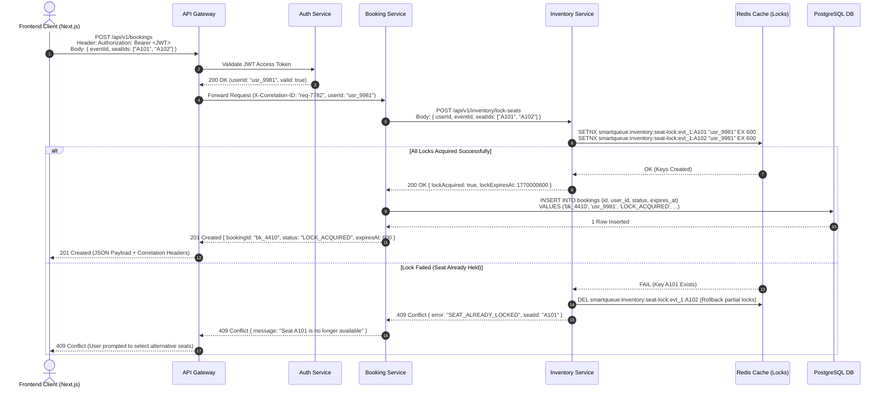
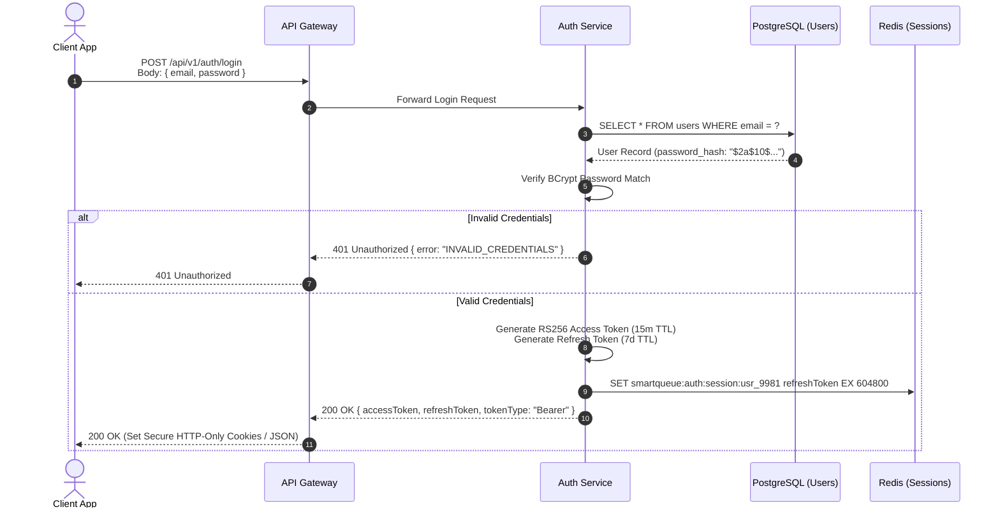

# SmartQueue AI — Synchronous Request Execution Flow

**Document ID:** `ARCH-04`  
**Version:** `1.0.0`  
**Status:** `Active`  
**Owner:** SmartQueue AI Architectural Board  

---

## 1. Overview

This document specifies the synchronous execution pathways for client requests entering SmartQueue AI. It details the end-to-end traversal from client applications through gateway edge layers, domain microservices, and infrastructure datastores back to the client.

```text
[ Frontend Client ] ──(HTTP/REST)──► [ API Gateway ] ──(REST/RPC)──► [ Microservices ] ──(SQL/Redis)──► [ Datastores ]
                                                                                                            │
[ Client UI ] ◄──(HTTP Response 200/409)────────────────────────────────────────────────────────────────────┘
```

---

## 2. High-Concurrency Seat Reservation Lock Flow

This request path represents the most critical hot path in SmartQueue AI: a user attempting to reserve seats during a flash sale.

### 2.1 Sequence Diagram



### 2.2 Detailed Step-by-Step Breakdown

1. **Request Ingestion:** The Next.js frontend sends an HTTP `POST` request to `/api/v1/bookings` with an `Authorization: Bearer <JWT>` header and JSON body containing `eventId` and selected `seatIds`.
2. **Gateway Authentication Check:** The API Gateway intercepts the request, extracts the JWT, and verifies its cryptographic signature against the Auth Service public key.
3. **Correlation ID Injection:** The Gateway generates a unique `X-Correlation-ID` header (`req-7782`) and appends `X-User-Id: usr_9981` to the downstream request context.
4. **Lock Acquisition Request:** The Booking Service calls the Inventory Service via internal HTTP/REST to lock the requested seats.
5. **Atomic Redis Lock Execution:** The Inventory Service issues an atomic Redis multi-key `SETNX` command with a 600-second TTL.
   - *Success Branch:* If all keys are successfully set, Redis returns `OK`. The Inventory Service returns HTTP 200 to Booking Service.
   - *Failure Branch (Race Condition):* If any requested seat is already locked by another user, Redis returns failure. The Inventory Service immediately releases any partial locks acquired during the attempt, preventing dangling locks, and returns HTTP 409 Conflict.
6. **Booking Persistence:** Upon successful lock acquisition, the Booking Service writes a record in `bookings` table with status `LOCK_ACQUIRED` and sets an expiration timestamp.
7. **Client Response:** The Gateway returns HTTP 201 Created to the client with booking ID, lock expiration timer, and correlation metadata.

---

## 3. User Authentication Flow



---

## 4. Related Documentation

- [System Architecture Overview](./01-system-overview.md)
- [Microservice Boundaries](./02-microservice-boundaries.md)
- [Service Responsibilities](./03-service-responsibilities.md)
- [Event Flow](./05-event-flow.md)
- [Engineering Constitution](../engineering-kit/00-ENGINEERING-CONSTITUTION.md)
