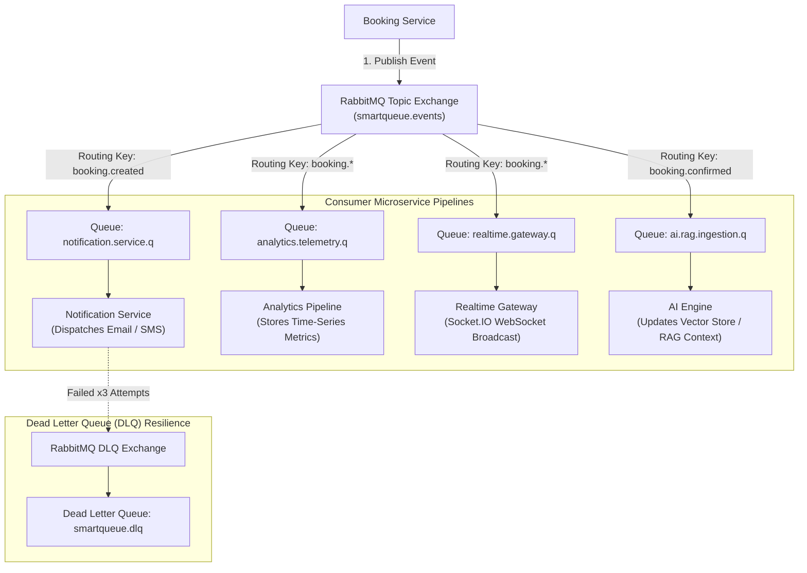

# SmartQueue AI — Asynchronous Event-Driven Architecture Flow

**Document ID:** `ARCH-05`  
**Version:** `1.0.0`  
**Status:** `Active`  
**Owner:** SmartQueue AI Architectural Board  

---

## 1. Overview

SmartQueue AI uses an asynchronous, event-driven messaging backbone powered by RabbitMQ to decouple core booking state mutations from downstream side effects (notifications, queue telemetry, realtime WebSocket broadcasts, and AI analytics).

```text
[ Booking Service ] ──(Publish AMQP)──► [ RabbitMQ Exchange: smartqueue.events ]
                                                     │
        ┌───────────────────┬────────────────────────┼────────────────────────┐
        ▼                   ▼                        ▼                        ▼
[ Notification Svc ] [ Analytics Consumer ]  [ Realtime Gateway ]     [ AI Services Engine ]
(Email/SMS Dispatch) (Queue Telemetry DB)    (Socket.IO Push to UI)   (RAG & Predictive Model)
```

---

## 2. Asynchronous Event Execution Flow

### 2.1 Event Pipeline Architecture Diagram



---

## 3. Event Routing & Messaging Topology

### 3.1 RabbitMQ Exchange & Queue Specifications

- **Exchange Name:** `smartqueue.events`
- **Exchange Type:** `topic` (Durable, Non-Auto-Delete)
- **Dead Letter Exchange:** `smartqueue.dlx` (`fanout`)

| Routing Key Pattern | Queue Name | Consumer Service | Purpose |
|---|---|---|---|
| `booking.created` | `notification.service.q` | Notification Service | Trigger booking reservation email / SMS confirmation |
| `booking.*` | `analytics.telemetry.q` | Analytics Pipeline | Record sales velocity, queue drain rate, and conversion metrics |
| `booking.*` | `realtime.gateway.q` | Realtime Gateway | Push live seat status and reservation state changes to WebSockets |
| `booking.confirmed` | `ai.rag.ingestion.q` | AI Services | Update vector database and refine wait-time prediction models |
| `inventory.depleted` | `realtime.gateway.q` | Realtime Gateway | Broadcast "SOLD OUT" overlay to clients viewing seat maps |

---

## 4. Canonical Event Schema Specifications

All events published to `smartqueue.events` must conform to the standard JSON event envelope:

### 4.1 `booking.created` Event Payload Schema

```json
{
  "eventId": "evt_9981a-4c22-8910",
  "eventType": "BOOKING_CREATED",
  "version": "1.0",
  "timestamp": "2026-07-26T23:50:00Z",
  "correlationId": "req-7782-9901-4412",
  "producer": "booking-service",
  "payload": {
    "bookingId": "bk_4410",
    "userId": "usr_9981",
    "eventId": "event_concert_2026",
    "seats": [
      {
        "seatId": "A101",
        "price": 150.00,
        "currency": "USD"
      },
      {
        "seatId": "A102",
        "price": 150.00,
        "currency": "USD"
      }
    ],
    "totalAmount": 300.00,
    "lockExpiresAt": "2026-07-26T24:00:00Z",
    "status": "LOCK_ACQUIRED"
  }
}
```

---

## 5. Consumer Pipeline Step-by-Step Traversal

### 1. Booking Service Event Publication
When a booking reservation transitions to `LOCK_ACQUIRED`, the Booking Service transactionally writes a `booking.created` record into an internal Outbox table and publishes the JSON payload to RabbitMQ `smartqueue.events` exchange under routing key `booking.created`.

### 2. RabbitMQ Topic Routing
RabbitMQ receives the message, inspects the routing key `booking.created`, and routes copies of the event payload to bound queues:
- `notification.service.q`
- `analytics.telemetry.q`
- `realtime.gateway.q`

### 3. Notification Service Consumer Processing
The Notification Service consumes the event, renders a reservation email template containing the `bookingId` and `lockExpiresAt` countdown, and dispatches the email via SMTP/SendGrid.

### 4. Realtime Gateway WebSocket Broadcast
The Node.js Realtime Gateway consumes the event from `realtime.gateway.q`, maps `userId` `usr_9981` to active Socket.IO connection rooms, and emits a WebSocket frame:
```json
// Socket.IO Event: booking:reservation_hold
{
  "bookingId": "bk_4410",
  "status": "LOCK_ACQUIRED",
  "expiresInSeconds": 600,
  "seats": ["A101", "A102"]
}
```
The client UI receives the frame and starts an interactive 10-minute payment countdown timer without requiring an HTTP poll.

### 5. Analytics Telemetry Consumer Processing
The Analytics worker ingests the event, updates time-series counters tracking tickets held per minute, and calculates current queue velocity.

### 6. AI Services Context Ingestion Pipeline
When `booking.confirmed` events arrive, the AI Service ingests the booking metadata, updates ChromaDB vector context, and recalibrates predictive models calculating expected queue wait times for remaining users in line.

---

## 6. Failure Recovery & Dead Letter Queue (DLQ) Strategy

- **Retry Policy:** Consumers attempt message processing up to 3 times with exponential backoff (1s, 5s, 25s).
- **Poison Pill Handling:** If a message fails processing after 3 attempts, the consumer rejects the message (`basic.nack(requeue=false)`).
- **DLQ Routing:** Unacknowledgeable messages are automatically routed by RabbitMQ to `smartqueue.dlx` exchange and stored in `smartqueue.dlq` for manual inspection and replay.

---

## 7. Related Documentation

- [System Architecture Overview](./01-system-overview.md)
- [Microservice Boundaries](./02-microservice-boundaries.md)
- [Service Responsibilities](./03-service-responsibilities.md)
- [Request Flow](./04-request-flow.md)
- [Engineering Constitution](../engineering-kit/00-ENGINEERING-CONSTITUTION.md)
